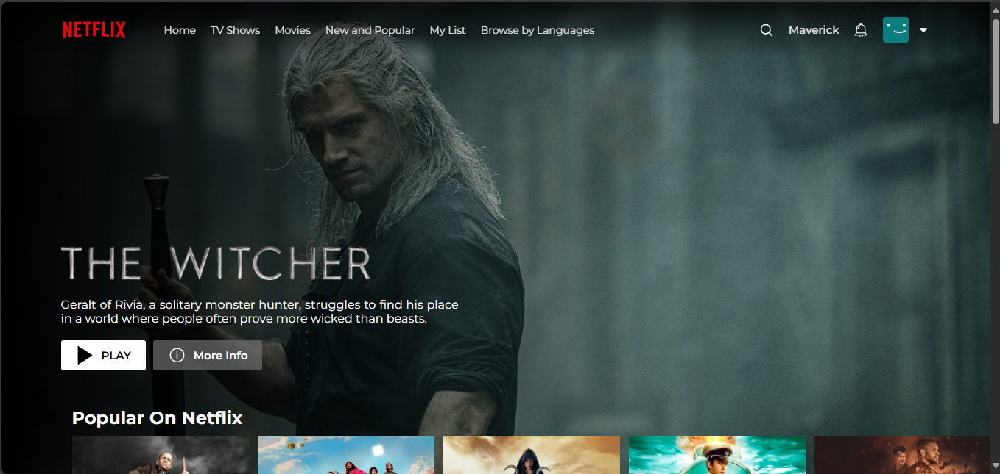
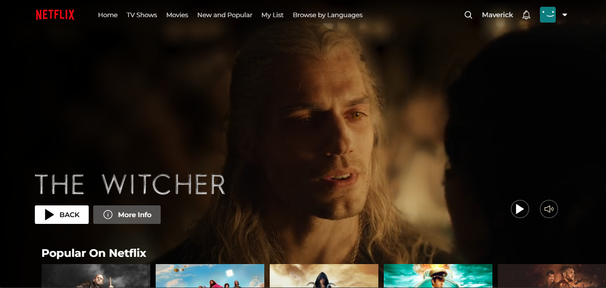
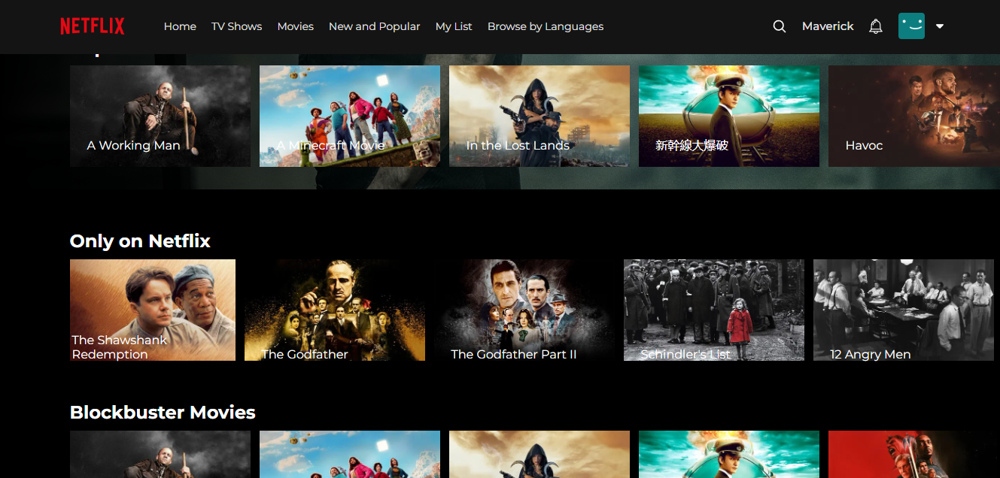
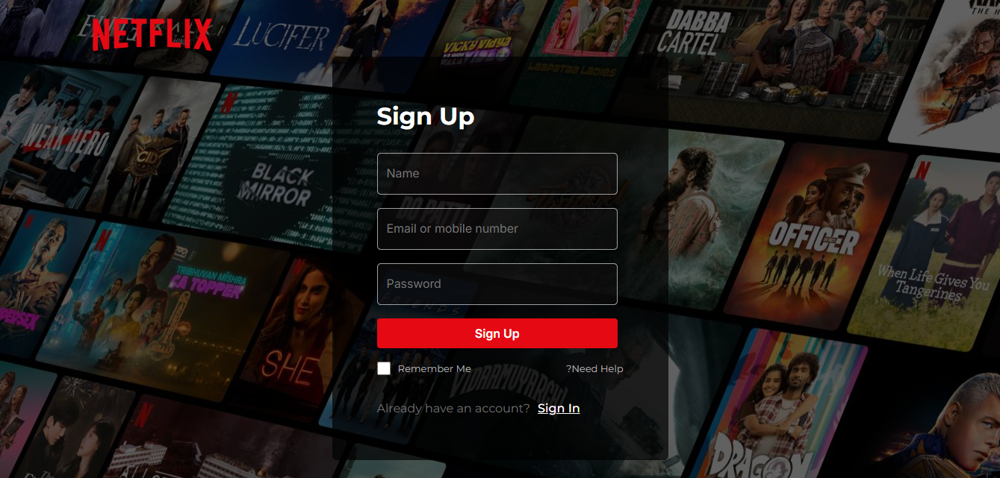
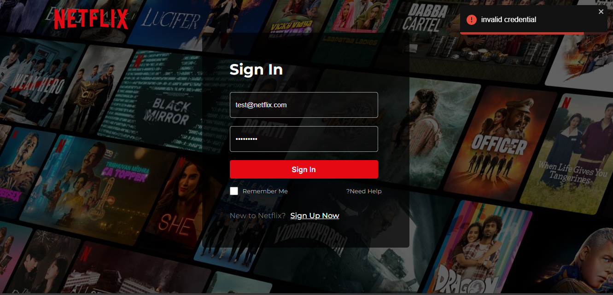
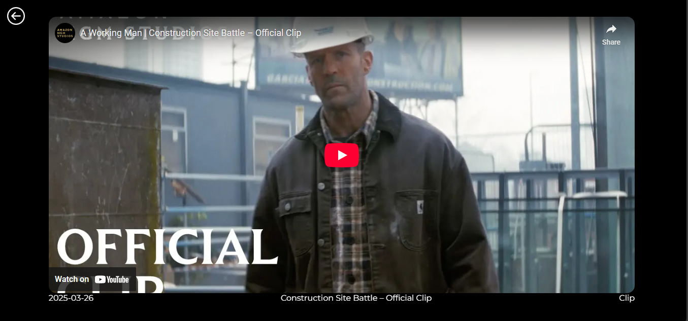

# 🎬 Netflix Clone

A Netflix clone built with **React.js** and **Firebase** that allows users to browse movies, view details, and log in using Google Authentication.

## 📸 Screenshots

### 🎬 Home Page




### 🔐 Login Page




### 🎥 Movie Player



## 📚 Table of Contents
- [About the Project](#about-the-project)
- [Features](#features)
- [Tech Stack](#tech-stack)
- [Setup Instructions](#setup-instructions)
- [Environment Variables](#environment-variables)
- [Screenshots](#screenshots)


## 📖 About the Project

This project replicates key features of the Netflix UI and functionality. Users can:
- Browse a list of movies fetched dynamically from an external API.
- View detailed movie information, including trailers.
- Authenticate securely using Google via Firebase.

Built with **React.js** on the frontend and **Firebase** for backend services, the application ensures a smooth and dynamic user experience with a modern, responsive design.

---

## 🚀 Features

- **Authentication**: Sign in with Google using Firebase Authentication.
- **Movie Browsing**: Fetches and displays movies across different categories like Trending, Originals, and Top Rated via TMDb API.
- **Responsive Design**: Fully responsive layout across mobile, tablet, and desktop.
- **Trailer Previews**: Watch trailers and explore detailed descriptions of movies.
- **Infinite Scrolling**: Load more content seamlessly as you scroll.

---

## 🛠 Tech Stack
This project was developed using the following technologies:

<p align="center">
  <a href="https://react.dev/" target="_blank" style="text-decoration: none;">
    
  </a>
  &nbsp;&nbsp;
  <a href="https://firebase.google.com/" target="_blank" style="text-decoration: none;">
    
  </a>
  &nbsp;&nbsp;
  <a href="https://www.themoviedb.org/" target="_blank" style="text-decoration: none;">
    
  </a>
</p>

- **Frontend**: React.js, React Router
- **Backend**: Firebase (Authentication, Firestore Database)
- **API**: The Movie Database (TMDb) API
- **Styling**: CSS, Flexbox, custom designs
- **Tools**: Vite, Firebase Console, VS Code, React Developer Tools

---

## 🛠️ Setup Instructions

### Prerequisites
- **Node.js** installed — [Download Node.js](https://nodejs.org/)
- Firebase project setup — [Firebase Console](https://console.firebase.google.com/)
- TMDb API key — [The Movie Database](https://www.themoviedb.org/)

---

### Installation Steps

1. Clone the repository:
   ```bash
   git clone https://github.com/Mudit-750/netflix-clone.git
   cd netflix-clone
   npm install
   npm run dev


## 🔐 Environment Variables

To run this project locally, you’ll need to create a `.env` file in the root directory with the following variables:

```env
# Firebase Config
VITE_FIREBASE_API_KEY=your_firebase_api_key
VITE_FIREBASE_AUTH_DOMAIN=your_project.firebaseapp.com
VITE_FIREBASE_PROJECT_ID=your_project_id
VITE_FIREBASE_STORAGE_BUCKET=your_project.appspot.com
VITE_FIREBASE_MESSAGING_SENDER_ID=your_messaging_sender_id
VITE_FIREBASE_APP_ID=your_firebase_app_id

# TMDB API
VITE_TMDB_API_KEY=your_tmdb_api_key
```
⚡ Important:

<li>Environment variables must start with VITE_ to be accessible inside your React app using Vite.</li>
<li>Access them in your code like this:</li>
const apiKey = import.meta.env.VITE_TMDB_API_KEY;

console.log(apiKey);

<li>A .env.example file is provided for reference in the repository.</li>

**You can copy the structure from .env.example provided in the repo.

